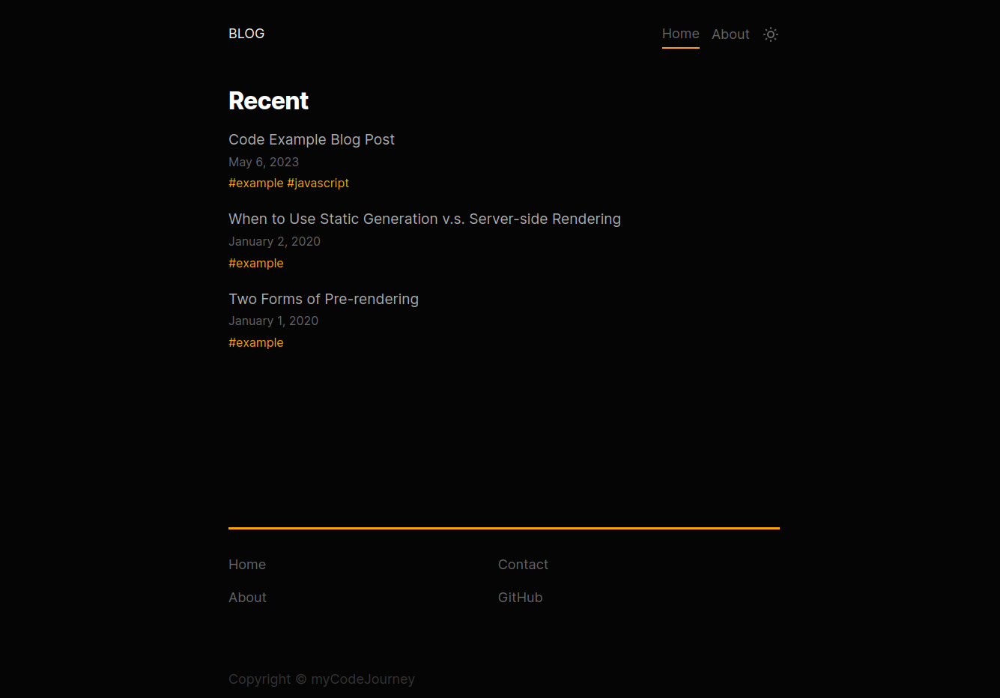
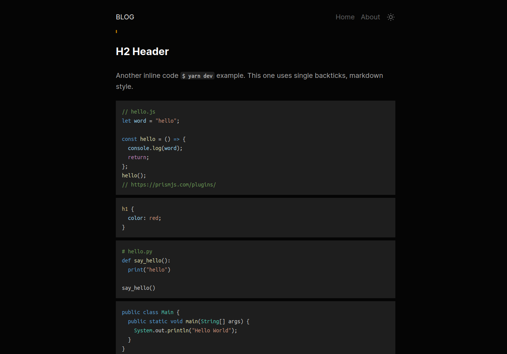
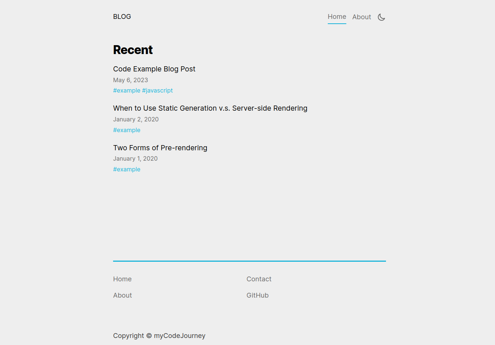

# My Code Journey - A Blog

## Contents

- [Overview](#overview)
- [Screenshots](#screenshots)
- [Start dev server](#start-dev-server)

## Overview

A blog made using NextJS. It has syntax highlighting for code blocks and a light/dark theme toggle.

I used the NextJS tutorial blog site as a starting point and added code syntax highligting and github flavoured markdown for the blog post content.

NOTE: I could not get syntax highlighting working using the Next App Router, so I stuck with the Page Router.

## Screenshots







## Start dev server

```sh
yarn # install dependencies
yarn dev # start dev server
```

Then go to `localhost:3000` or whatever url it gives in the console.
